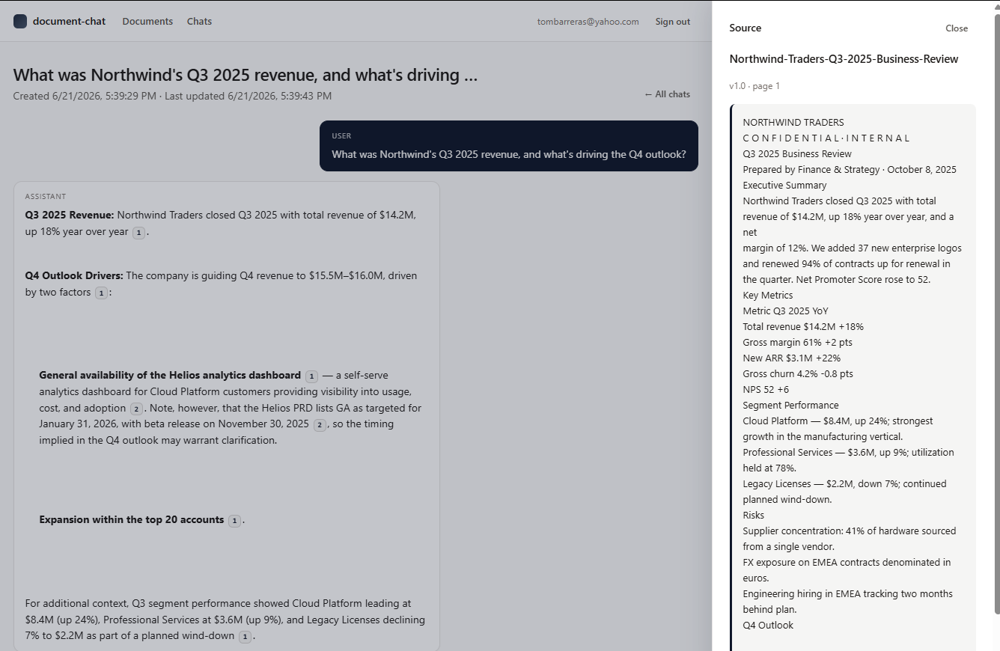
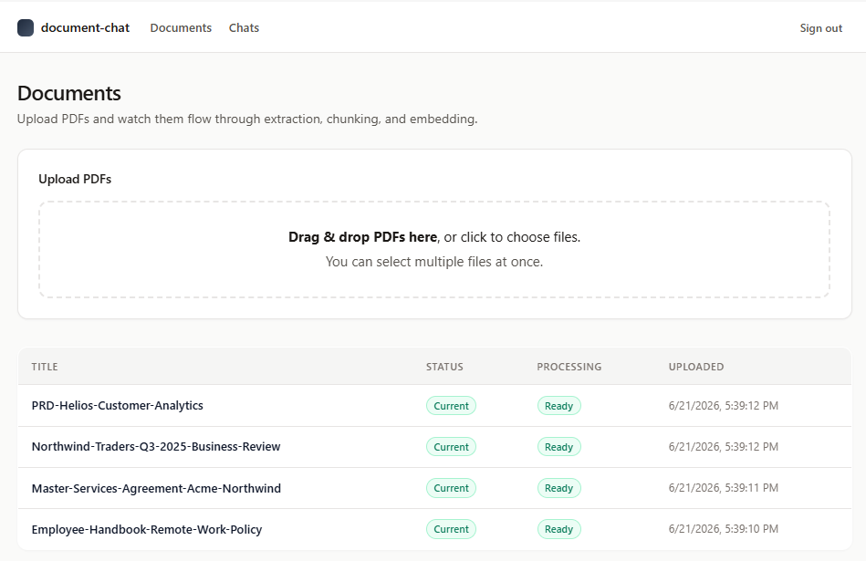
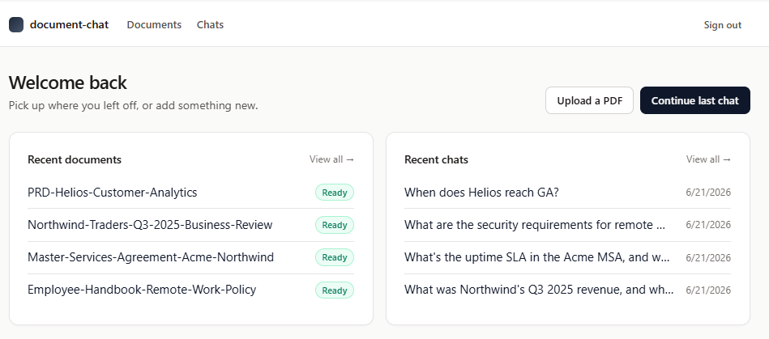
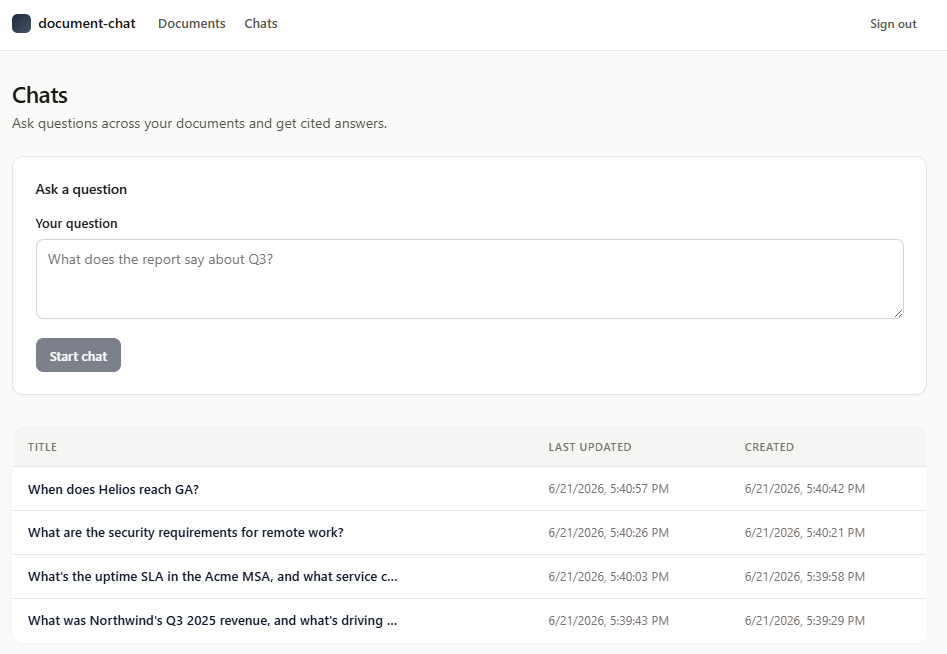
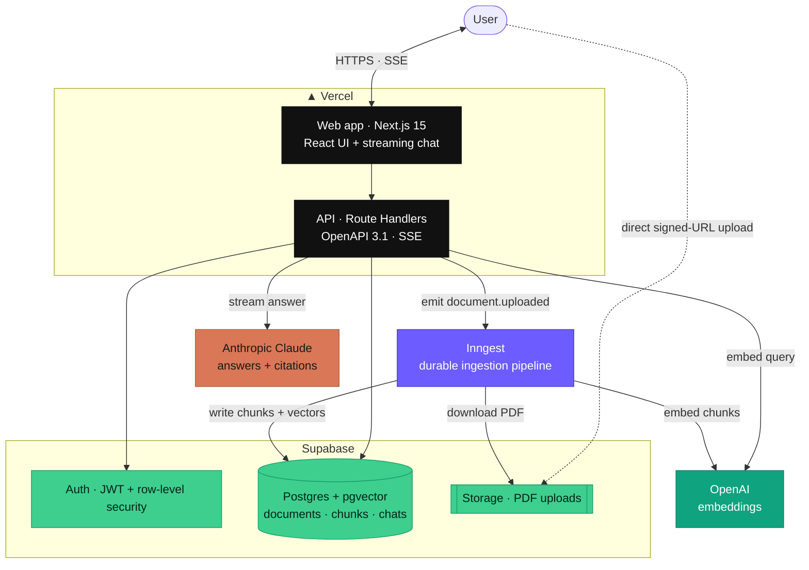
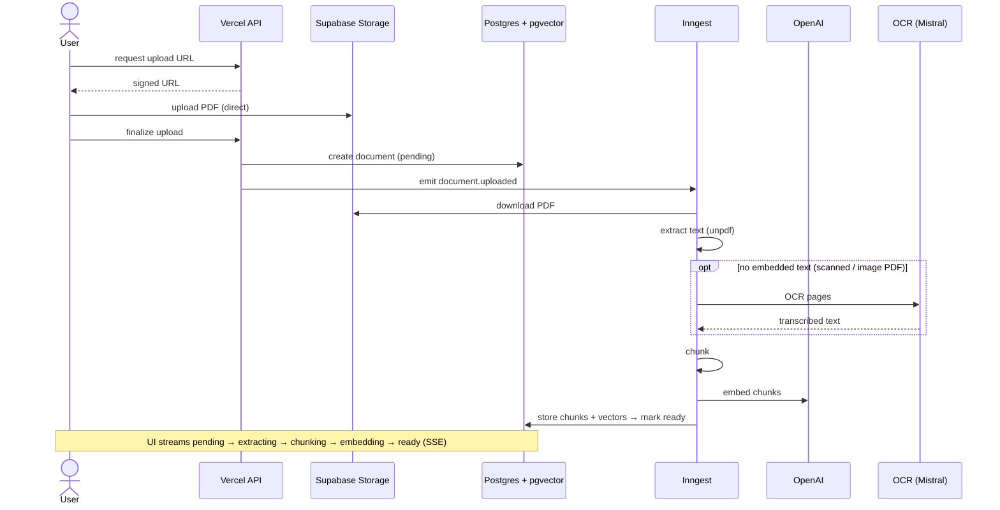
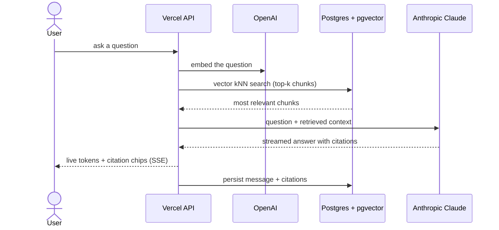

# Document Chat — an AI chat interface for your business documents

**Upload your PDFs — contracts, reports, handbooks, policies — and ask questions in plain English. Every answer streams back in seconds with citations that link to the exact passage it came from, so you can trust it and verify it.**

This is a production-grade Retrieval-Augmented Generation (RAG) application. It handles messy real-world documents (including **scanned PDFs**, via OCR), remembers the conversation, and shows its sources.



---

## See it in action

| | |
|---|---|
| **Cited answers** — every claim links to its source chunk; click a citation to open the passage. | **Documents** — drag-and-drop upload with live ingestion status. |
|  |  |
| **Home / dashboard** — recent documents and chats at a glance. | **Conversations** — revisit and continue past chats. |
|  |  |

---

## What it does for your business

Teams drown in documents. This puts a chat box in front of yours:

- **Contracts & legal** — "What's the uptime SLA and the termination notice period in this MSA?"
- **Finance & reporting** — "What was Q3 revenue and what's driving the Q4 outlook?"
- **HR & policies** — "What are the security requirements for remote work?"
- **Product & engineering** — "When does this feature reach GA, and what are the v1 non-goals?"
- **Support & knowledge bases** — turn a folder of manuals into an instant answer desk.

Because every answer cites its source, it's suitable for work where being *right* matters — and where "the AI made it up" isn't acceptable.

---

## Features

- **Cited answers you can verify.** Responses stream token-by-token and carry inline citation chips that open the exact source passage in a side drawer.
- **Works with scanned documents.** Image-only PDFs (photocopies, faxes, signed contracts) are transcribed automatically via OCR, then indexed like any other document.
- **Conversation memory.** Follow-up questions understand everything asked and answered earlier in the chat.
- **Drag-and-drop, multi-file upload** with a durable pipeline and **live status** — watch each document move through extraction → chunking → embedding → ready.
- **Document lifecycle** — download the original, browse a full ingestion **history**, reprocess on demand, and upload a **new version**.
- **Markdown-formatted answers** — headings, lists, and tables render properly, not as raw text.
- **Secure multi-tenant foundation** — authentication with row-level security so each account only ever sees its own documents.

---

## Tech stack

A modern, fully-typed TypeScript stack on managed cloud infrastructure.

| Area | Technologies |
|---|---|
| **Frontend** | Next.js 15 (App Router), React 19, TypeScript, Server Components, Server-Sent Events (token streaming), `react-markdown` |
| **API** | Next.js Route Handlers, **contract-first OpenAPI 3.1** spec driving a generated, type-safe client |
| **AI / RAG** | **Retrieval-Augmented Generation**, Anthropic **Claude** (answers + citations), **OpenAI** embeddings (`text-embedding-3-small`), **Mistral OCR**, vector kNN retrieval |
| **Data & infra** | **Supabase** — Postgres + **pgvector**, Auth + Row-Level Security, Storage (signed-URL uploads); **Inngest** durable background jobs; **Vercel** hosting |
| **Tooling & quality** | pnpm + **Turborepo** monorepo, **Vitest** (unit + integration), **Playwright** (E2E), **GitHub Actions** CI, an automated **evaluation harness** that gates merges on citation-precision, Apache-2.0 |

---

## How it works

A retrieval-augmented Q&A service over your own PDFs, **API-first**: an OpenAPI 3.1 contract drives both the backend and a generated, type-safe frontend client, and it runs entirely on managed cloud services.

### System overview



### Ingestion — upload → searchable

The browser uploads straight to storage via a signed URL (bypassing serverless
body limits); a durable Inngest pipeline then extracts, chunks, and embeds the
document, streaming live status to the UI. Scanned or photocopied PDFs that
carry no embedded text fall back to OCR (Mistral OCR by default) so an
image-only document still becomes searchable instead of dead-ending.



#### Scanned PDFs / OCR

`unpdf` extracts embedded text. When a PDF yields none — a scan or photocopy
whose pages are images — the extract step calls an OCR provider as a fallback,
then continues to chunk → embed as usual. `OCR_PROVIDER` selects the engine:

- **`mistral`** (default) — a dedicated OCR engine; no LLM content filter, so it
  transcribes standardized/boilerplate text (the kind contracts and forms are
  full of), and it's cheaper per page. The right default for a document corpus.
- **`claude`** — Claude vision; reuses your `ANTHROPIC_API_KEY`, so no new
  vendor. Its output content filter can refuse to reproduce standardized
  boilerplate verbatim, so it's better for ad-hoc scans than contract/form corpora.
- **`none`** — disable OCR; textless PDFs fail fast with a clear reason.

The providers live behind a small interface in
[`packages/retrieval/src/providers/ocr`](./packages/retrieval/src/providers/ocr),
so swapping engines is a one-file change.

### Answering a question — RAG + citations

The query is embedded and matched against the document vectors; the most
relevant chunks (plus the chat's earlier turns, for follow-up context) are
handed to Claude, which streams a Markdown-formatted answer whose citations
point back to specific source chunks.



---

## Engineering practices

This is built the way a production system should be:

- **Contract-first** — a single OpenAPI 3.1 spec is the source of truth; the typed client is generated from it, so frontend and backend can't drift.
- **Tested at every level** — unit + contract tests (Vitest), Supabase-backed integration tests, and Playwright end-to-end tests.
- **Quality-gated CI** — every change runs lint, type-check, tests, secret scanning, and an **automated evaluation harness** that scores answer/citation quality against a golden Q&A set; merges are gated on a citation-precision threshold.
- **Durable, observable pipeline** — ingestion runs as checkpointed background steps (Inngest), so a failure retries the failed step instead of re-doing the whole document.

---

## Run it locally

Prerequisites: **Node 20** (`.nvmrc`), **pnpm 9** (`corepack enable pnpm`),
**Docker** (for Supabase), and the **Supabase CLI**. See
[docs/deploy.md](./docs/deploy.md#prerequisites) for OS-specific install instructions.

```bash
pnpm install
cp .env.example .env.local      # add OpenAI + Anthropic (+ Mistral for OCR) keys
pnpm dev:all                    # supabase start + next dev
pnpm dev:inngest                # second terminal — discovers /api/inngest
```

Open <http://localhost:3000>, sign up, upload a PDF, wait for `ready`, and start a chat.

### Environment

- `OPENAI_API_KEY` — embeddings (used at ingestion and retrieval).
- `ANTHROPIC_API_KEY` — chat completion (Claude).
- `MISTRAL_API_KEY` — OCR for scanned PDFs (default engine; optional otherwise).

See [`.env.example`](./.env.example) for the full matrix.

## Project structure

```
apps/web/                 Next.js 15 app — Route Handlers (/api/*) + UI
apps/eval-cli/            Thin CLI around @document-chat/eval (mock + live)
packages/contracts/       OpenAPI 3.1 spec, SSE event schema, generated types
packages/retrieval/       Chunking + embeddings + kNN search + OCR providers
packages/eval/            Golden Q&A loader, metrics, runner, fixtures
supabase/                 Local dev config + SQL migrations
docs/                     deploy.md, screenshots, Architecture Decision Records
.github/workflows/        CI, secret scan, eval, smoke, auto-merge
```

## Common commands

| Command | What it does |
|---|---|
| `pnpm dev:all` | Start Supabase, then the web app |
| `pnpm dev:inngest` | Start the Inngest dev server (discovers `/api/inngest`) |
| `pnpm build` | Build all packages via Turborepo |
| `pnpm test` | Unit + contract tests (Vitest) |
| `pnpm test:integration` | Supabase-backed integration tests |
| `pnpm test:e2e` | Playwright end-to-end tests |
| `pnpm lint` / `pnpm typecheck` | ESLint / TypeScript checks |
| `pnpm --filter eval-cli run start -- --mock` | Run the golden eval against canned transcripts |

## Design & decision docs

- **[architecture.md](./architecture.md)** — technology choices and system shape.
- **[requirements.md](./requirements.md)** — behavioral requirements by phase.
- **[implementation.md](./implementation.md)** — delivery plan and working agreements.
- **[docs/adr/](./docs/adr/)** — Architecture Decision Records (one per material choice).

---

## About

Built by **[Thomas-J-Barreras Consulting](https://github.com/Thomas-J-Barreras-Consulting)** as a demonstration of production AI application engineering — RAG, full-stack TypeScript, and cloud-native delivery. Available for similar work: AI chat over your documents, RAG systems, and LLM application development.

## License

[Apache 2.0](./LICENSE). See [NOTICE](./NOTICE) for attribution.
