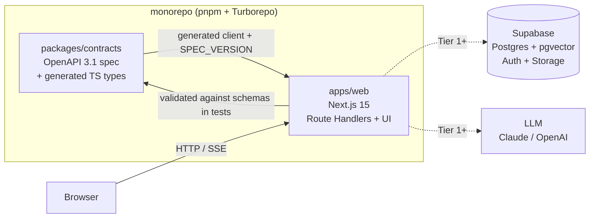

# Knowledge Graph Document Chat — starter

A production-grade document Q&A system with traceable citations,
document-lifecycle awareness, and a knowledge-graph layer. This repository is
the **open-source Apache 2.0 starter** (Tiers 0–1): a credible, deployable,
forkable foundation. The commercial product (Tiers 2–4) is built privately on
top of it.

> **Status:** Tier 0 — the chassis. A deployable hello-world with every
> engineering practice wired up (API-first contract, test-first, green CI).
> Document upload, retrieval, and citation chat arrive in Tier 1.

## Quick start

Prerequisites: **Node 20** (`.nvmrc`) and **pnpm 9** (`corepack enable pnpm`).

```bash
pnpm install
pnpm dev
```

Open <http://localhost:3000>. The Tier 0 API is live at:

- `GET /api/health` — liveness + per-dependency checks
- `GET /api/version` — build version, spec version, environment, git SHA

The database (Supabase) is only needed from Tier 1 — see
[docs/deploy.md](./docs/deploy.md) for `pnpm db:start` and deployment.

## Architecture

API-first: the OpenAPI 3.1 spec in `packages/contracts` is the source of
truth. The backend implements it and the frontend consumes a generated,
type-checked client. CI fails if the implementation drifts from the contract.



Full detail: [architecture.md](./architecture.md).

## Project structure

```
apps/web/                 Next.js 15 app — Route Handlers (/api/*) + UI
packages/contracts/       OpenAPI 3.1 spec, SSE event schema, generated types
supabase/                 Local dev config + SQL migrations
docs/                     deploy.md + Architecture Decision Records (adr/)
scripts/                  Repo tooling (license-header check, …)
.github/workflows/        CI, DCO, and gitleaks secret scanning
```

## Common commands

| Command | What it does |
|---|---|
| `pnpm dev` | Run the web app (no database needed for Tier 0) |
| `pnpm dev:all` | Start Supabase, then the web app |
| `pnpm build` | Build all packages via Turborepo |
| `pnpm test` | Run unit + contract tests (Vitest) |
| `pnpm lint` / `pnpm typecheck` | ESLint / TypeScript checks |
| `pnpm license:check` | Verify SPDX headers on source files |
| `pnpm --filter @document-chat/contracts run generate` | Regenerate the TS client from the spec |
| `pnpm db:start` / `pnpm db:reset` / `pnpm db:stop` | Local Supabase lifecycle |

## Planning docs

- **[goals.md](./goals.md)** — business goals, public/private structure, licensing.
- **[requirements.md](./requirements.md)** — behavioral requirements by phase.
- **[architecture.md](./architecture.md)** — technology choices and system shape.
- **[implementation.md](./implementation.md)** — tiers, working agreements, plan.

## Contributing

Contributions require a DCO sign-off (`git commit -s`). See
[CONTRIBUTING.md](./CONTRIBUTING.md).

## License

[Apache 2.0](./LICENSE). See [NOTICE](./NOTICE) for attribution.
